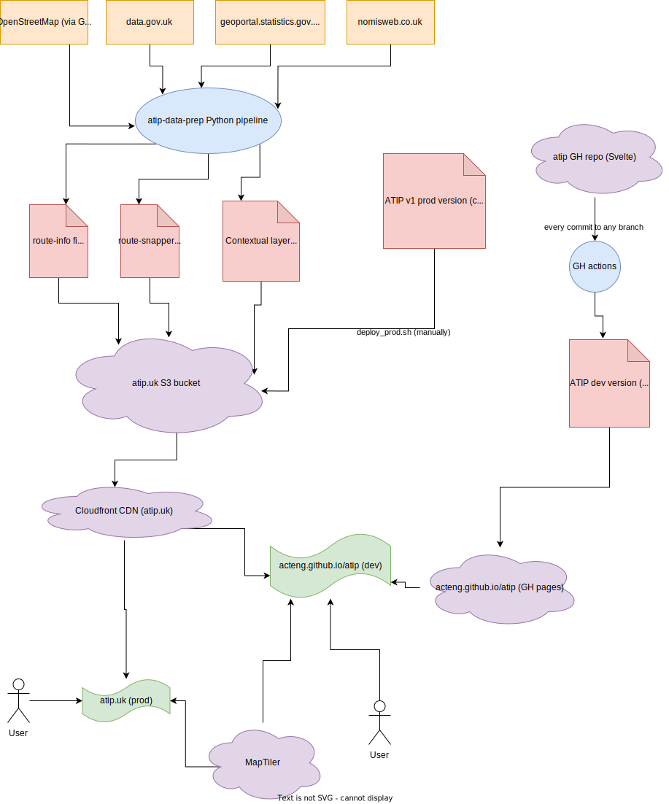
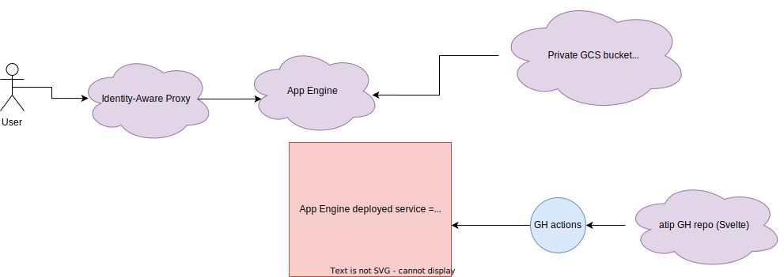

# Architecture

"ATIP" can be split into two pieces of functionality, with different users:

- Scheme Sketcher: for external authorities to sketch GeoJSON files
- Scheme Browser: for internal ATE users to explore all submitted schemes

## Current (August 2023)

Current hosting is on Amazon, managed by Dustin. The monthly costs have been under 1 USD. S3 is used for static file storage, Cloudfront as a CDN, and Route 53 for the atip.uk domain.

### atip-data-prep

[atip-data-prep](https://github.com/acteng/atip-data-prep) is a Python pipeline that produces static data files used in the web app. All of the input and output is currently public. The pipeline is manually run by ATE developers; there's no intention to automatically run it.

Input:

- OpenStreetMap, via [Geofabrik](https://download.geofabrik.de/europe/great-britain/england.html)
- <https://data.gov.uk>
- <https://geoportal.statistics.gov.uk>
- <https://www.nomisweb.co.uk>

Output:

- Route snapper and route info files (one `.bin.gz` file per configured area)
- Many contextual layers (MRN, POIs, census data, etc), as PMTiles or GeoJSON files covering all of England

Output files are manually uploaded into the `atip.uk` S3 bucket. Everything is organized by an arbitrary version number, so we can make the dev and prod web app point to different versions of data.

### atip web app

[atip](https://github.com/acteng/atip) is a Svelte app. It has no backend server; it's compiled into a static set of HTML, CSS, and JS files and served through S3 and Cloudfront.

There are two deployments of it:

- prod, at <https://atip.uk> (Cloudfront and Route 53)
  - Deployed [manually](https://github.com/acteng/atip/blob/main/deploy_prod.sh), and hasn't been updated since March 2023
- dev, at <https://acteng.github.io/atip/> (Github Pages)
  - [Github Actions](https://github.com/acteng/atip/blob/main/.github/workflows/web.yml) continuously deploys this
  - Along with the `main` branch, most in-progress branches are also built and served to easily get feedback on in-development changes

An user accessing ATIP in their browser will depend on:

- Either Cloudfront (for prod) or Github Pages (for dev)
- Files from atip-data-prep, served by Cloudfront
- [MapTiler](maptiler.com) for the basemap
  - Note we can readily switch to another basemap provider, or self-host tiles for England, if needed
- GeoJSON files manually loaded in the app by the user
  - For the scheme sketcher, a file representing a single scheme. Also stored in browser local storage for convenience.
  - For the scheme browser, a file representing all submitted schemes. This file is manually shared with appropriate users through internal Sharepoint.
  - These never hit the network

The "output" of the ATIP scheme sketcher is a GeoJSON file of the scheme the user has drawn. The user can download the file to their computer, then submit through SmartSurvey, load the file into another GIS system, etc.

### Diagram

Made via <https://draw.io>

## Proposed architecture

This section is a refinment of [questions raised here](backend.md).

We will deploy a new developer environment on GCP, protected by authentication and including a database and REST API server. We will also keep the existing dev environment on Github Pages, with no backend or authentication, and use feature flags in the frontend Svelte app to handle both environments.

The new GCP deployment will:

- Be a step towards hosting on an official GCP project and gov.uk domain
- Align with the architecture of other ongoing projects
- Allow us to explore integrations with a Postgres database and a REST API backend

This new deployment will **only** be used by internal ATE users and contain no real data yet.

### Step 1: migrate to GCP as-is

Dustin will provision a GCP project and continuously deploy the `main` branch of ATIP there. The exact GCP stack is TBD, but it's likely:

- GCS for storing the atip-data-prep files
- building a Docker container to serve the compiled Svelte app, using a simple web server like [Express](https://expressjs.com) or [Flask](https://flask.palletsprojects.com/en/2.3.x/)
- Artifact Registry to store the containers
- Cloud Run to serve them

(A simpler alternative may be App Engine standard environments.)

We'll build on recent/ongoing spikes and use Terraform to configure everything.

### Step 2: add auth

We'll configure [IAP](https://cloud.google.com/iap) to sit in front of the web app, and not serve anything at all (from the Docker container or GCS bucket) until the user has logged in. We'll manually add a few internal ATE people for testing.

Next, we'll [generate fake data](https://github.com/acteng/atip/blob/main/src/random_schemes.ts) for the scheme browser, and host it on GCS. We'll add a feature flag to the Svelte app. For this new GCP deployment, we'll automatically load this fake file representing all submitted scheme data, instead of ask the user to load a file.

### Diagram

